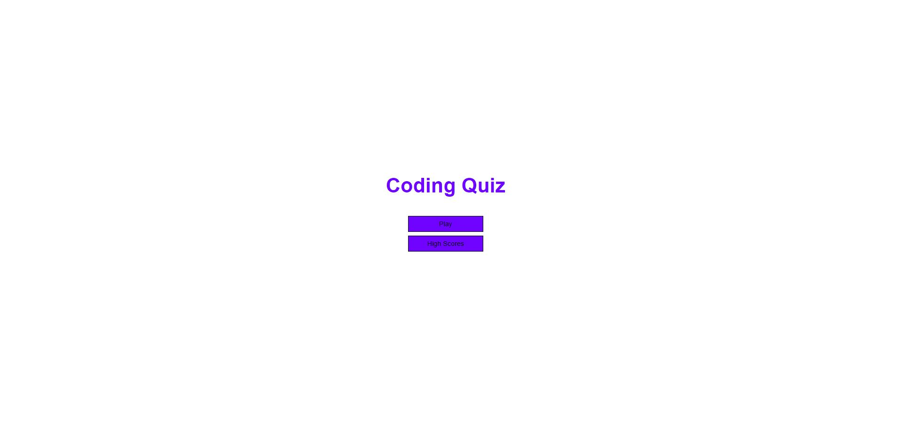
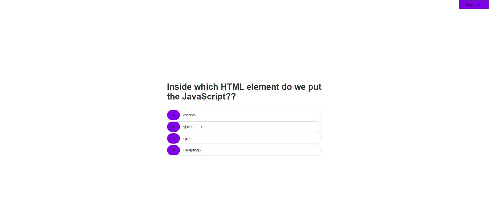
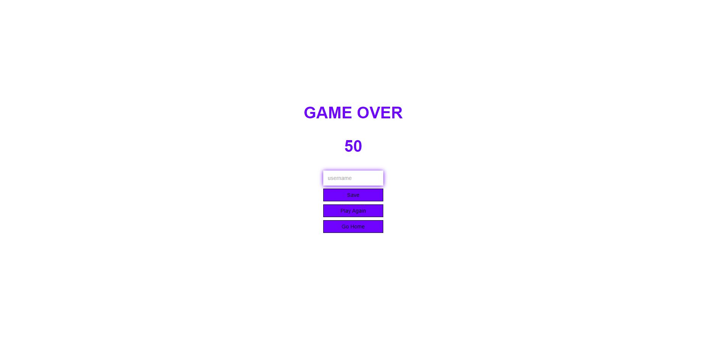
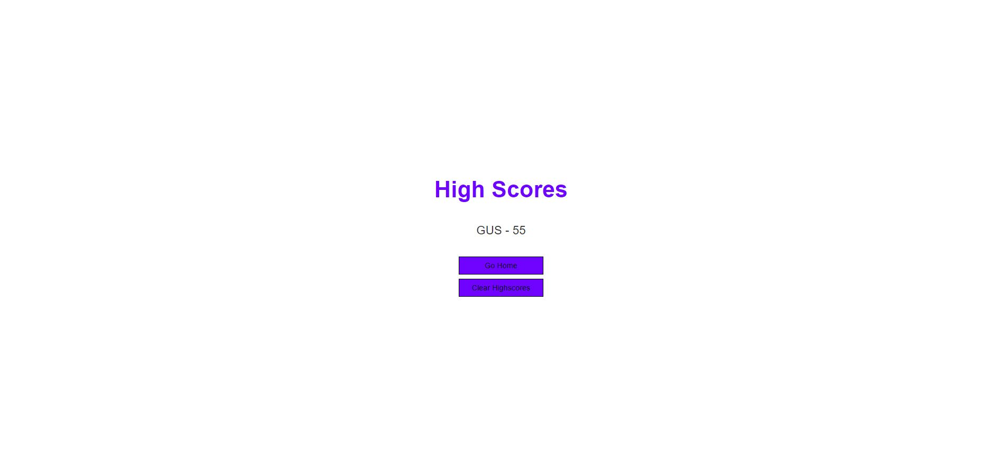

# Coding Quiz App

## Homework - week 4

## Short description

I have created a Quiz Game with the criteria below.

```
GIVEN I am taking a code quiz
WHEN I click the start button
THEN a timer starts and I am presented with a question
WHEN I answer a question
THEN I am presented with another question
WHEN I answer a question incorrectly
THEN time is subtracted from the clock
WHEN all questions are answered or the timer reaches 0
THEN the game is over
WHEN the game is over
THEN I can save my initials and my score
```

## Table of Contents 

- [Screenshots](#screenshots)
- [Github](#github)

## Screenshots










## Github

1. I have created a new repository on your GitHub account and clone it to my computer.

2. I used the `git add`, `git commit`, and `git push` commands to save and push my code to my GitHub repository.

3. My repository is https://github.com/gharduim/Coding-Quiz

4. My live webpage is  https://gharduim.github.io/Password-generator/